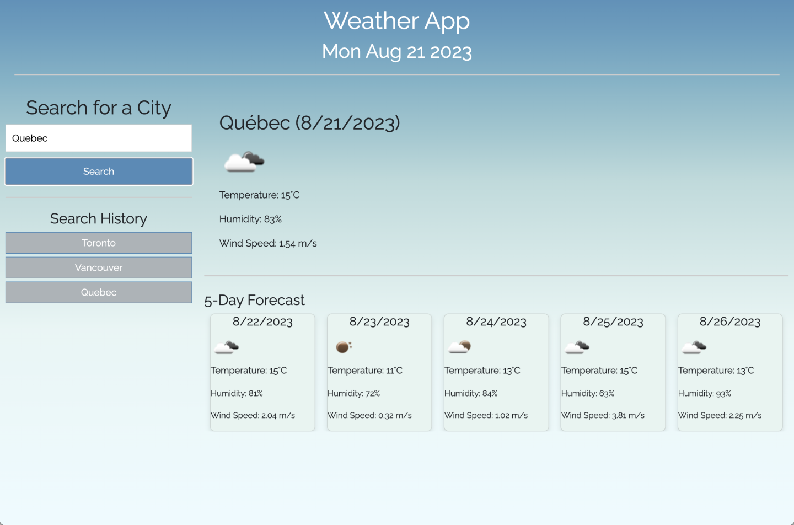

# weather-forecast-app
This repo contains the Module 06 Challenge. This repository contains a dynamic weather dashboard offering real-time and 5-day forecasts.

## Instalation
N/A

## Usage
You can visit the live website by clicking on the following link:
 https://carlos-2mm.github.io/weather-forecast-app/

A preview of the website:

## Credits

https://fonts.googleapis.com/css2?family=Inter&family=Raleway&display=swap"
 Serves as the resource for the Raleway font.

https://getbootstrap.com/docs/4.5/components/buttons/
 Reference for styling and behavior of buttons in the project.

https://jquery.com/
 Resource for leveraging the jQuery library (Version 3.5.1). Provided by jQuery Foundation. Reference for dynamic DOM manipulation and event handling in the project.

https://openweathermap.org/api
 Resource for understanding and implementing the OpenWeatherMap API's features. Provided by OpenWeather Ltd. Reference for fetching and displaying weather-related data in the project.

## License

Please refer to the LICENSE in repo